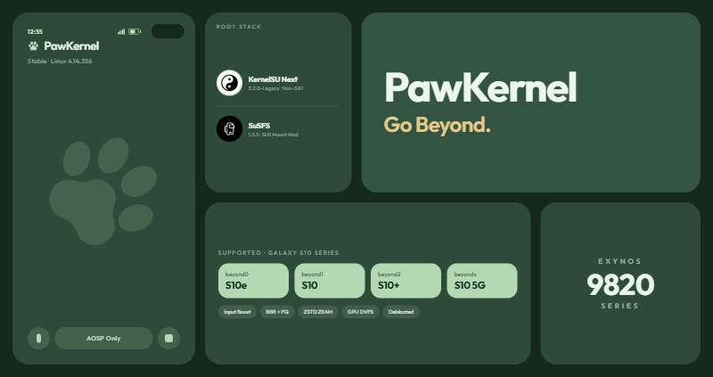

# PawKernel

### Go Beyond.

A custom kernel for the **Samsung Galaxy S10 series** (Exynos 9820)

---

## ✨ Features and Tweaks

- **KernelSU-Next** (`3.2.0-Legacy`, Non-GKI) — root with a manual/ioctl supercall
  hook.
- **SuSFS `1.5.5`** + **SUS Mount / SUS_MAP** reimplementation
- **Touch and fingerprint boost** — lower input latency on scroll/unlock without
  pinning the clocks to max (battery-friendly).
- **Networking** — BBR congestion control + FQ qdisc by default.
- **Memory** — ZSTD ZRAM with writeback of cold pages.
- **GPU DVFS tuning** — faster ramp-up under load at a stable 702 MHz (no overclock).
- **Deblobbed** & cleaned defconfig (debug overhead removed) for a smaller image file.
- **AOSP-based ROMs only** (LineageOS, EvolutionX, etc.) — Do not try on One UI, ur phone may bootloop.

---

## 📱 Supported devices

All four Exynos 9820 variants should work fine with this kernel:

S10e - beyond0lte - **Untested** | S10 - beyond1lte - **Untested** | S10+ - beyond2lte - Tested, working | S10 5G - beyondxlte - **Untested**

> ⚠️ **Not supported:** 
> Galaxy Note 10 (Exynos 9825) and any
> **Snapdragon** variant (models ending in U / W / 1 — are **not** supported).

---

## 📦 Installation

> [!WARNING]
> Flashing a custom kernel requires an **unlocked bootloader** Make a backup if you're doing it for
> the first time. You do this at your own risk:

> * Your warranty is now void.
> * I am not responsible for bricked devices, dead SD cards,
>   thermonuclear war, or you getting fired because the alarm app failed. Please
>   do some research if you have any concerns about doing this to your device.
> * **YOU** are choosing to make these modifications, and if
>   you **point the finger at me** for messing up your device, I will laugh at you.

**Requirements**
- A Galaxy S10 (Exynos 9820) running an **AOSP-based ROM**, From android 14–16 (QPR2 Supported).
- A custom recovery (e.g. LineageOS recovery / TWRP).

**Steps**
1. Download the latest **`PawKernel-...-Stable.zip`** from the
   [Releases](../../releases) page.
2. Reboot into your custom recovery.
3. Flash the zip using ADB Sideload or "Select from disk/Install menu (if using TWRP).
4. Reboot to system.
5. Install the [**KernelSU-Next Manager**](https://github.com/KernelSU-Next/KernelSU-Next/releases/) app to manage root.

## 🧱 Built from source

PawKernel is a set of patches on top of the LineageOS kernel tree:

- **Base:** [LineageOS/android_kernel_samsung_exynos9820](https://github.com/LineageOS/android_kernel_samsung_exynos9820) (`lineage-23.2`)
- **Toolchain:** Neutron Clang 23 (`LLVM=1 LLVM_IAS=1`)

The full, GPL-compliant kernel source lives in its own repository:
**[android_kernel_samsung_exynos9820](https://github.com/dusklteee/android_kernel_samsung_exynos9820)**.

Every change made on top of the base is summarized in the
[Highlights](#-highlights) above; the full release history is in
[`docs/CHANGELOG.md`](docs/CHANGELOG.md).

The flashable zip is produced with [AnyKernel3](https://github.com/osm0sis/AnyKernel3)
(the customized installer lives in [`installer/`](installer/)).

---

## 📦 Credits

- [**LineageOS**](https://github.com/LineageOS) — the kernel base.
- [**KernelSU-Next**](https://github.com/KernelSU-Next/KernelSU-Next) — root solution.
- [**simonpunk/susfs4ksu**](https://gitlab.com/simonpunk/susfs4ksu) — SuSFS.
- [**Sultanxda**](https://github.com/kerneltoast) — original CPU input boost / fp-boost tweak.
- [**osm0sis/AnyKernel3**](https://github.com/osm0sis/AnyKernel3) — installer framework.

---

## 📄 License

PawKernel is derived from the Linux kernel and is released under the
**GNU General Public License v2.0** — see [`LICENSE`](LICENSE).
